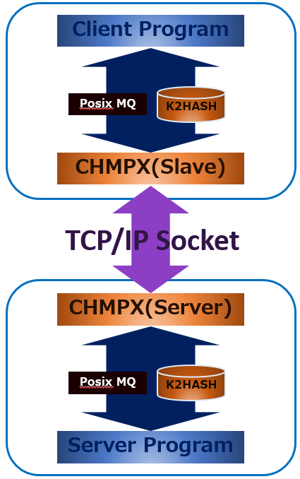

# CHMPX
**CHMPX** (**C**onsistent **H**ashing **M**q in**P**rocess data e**X**change) is communication middleware over the network for sending binary data.

CHMPX is responsible for communication between the server program and the client program and hides the network communication connection from each program.  
In addition, CHMPX is a high-speed communication middleware that adopts a cluster configuration, has tolerance at the occurrence of failure due to multiplexing, and can autoscale.  
CHMPX provides CHMPX programs for proxy and CHMPX libraries used by server/client programs.

## Overview
As shown in the figure, the server/client program and CHMPX are connected as IPC(Inner Process Communication), and responsible for sending/receiving data between server program and client program.  
Communication between CHMPX processes seems to be RPC (Remote Procedure Call).  
Therefore, the system using CHMPX is IPC over RPC.  
(you can easily understand by imagining the NFS daemon program.)

Communication between client programs is designed to enable transmission and reception of binary data.  
In IPC between the client program and CHMPX, posix MQ and [K2HASH](https://k2hash.antpick.ax/) are used, and asynchronous communication of large capacity data is possible.  
CHMPX is always connected by TCP Socket, it minimizes the cost of connection and reconnection.

By using CHMPX, communication between client programs can hide its route and configuration.  
And network routes and configuration can be set separately from the client program by CHMPX.
