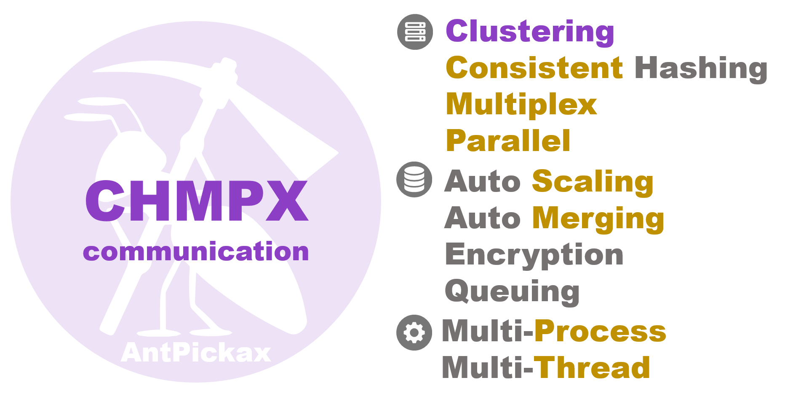

# **CHMPX**
**CHMPX** (**C**onsistent **H**ashing **M**q in**P**rocess data e**X**change) is communication middleware over the network for sending binary data.
**CHMPX** is one of [AntPickax](https://antpick.ax/)'s open source product by Yahoo! JAPAN.  

## {{ page.arrow_link_overview }}
[Overview](home.html) about **CHMPX** library and component.

## {{ page.arrow_link_feature }}
The explanation of the detailed [Feature](feature.html) of **CHMPX** library and component.

## {{ page.arrow_link_details }}
The explanation of the detailed [Details](details.html) of **CHMPX** library and component.

## {{ page.arrow_link_usage }}
How to [use](usage.html) **CHMPX** library and component for your program.

## {{ page.arrow_link_build }}
How to [build](build.html) **CHMPX** library and component from [source code]({{ site.github.repository_url }}) on Github.

## {{ page.arrow_link_developer }}
Detailed description of the programming interface provided by **CHMPX** library and component for [developer](developer.html)s.

## {{ page.arrow_link_environments }}
Description of [Environment](environments.html) variables used by **CHMPX** library and component to load.

## {{ page.arrow_link_tools }}
A list of [Tools](tools.html) provided by **CHMPX** and their explanations.

# **About AntPickax**
[AntPickax](https://antpick.ax/) is product group that is provided as open source by Yahoo! JAPAN.  
Please see the [AntPickax](https://antpick.ax/) details page.
